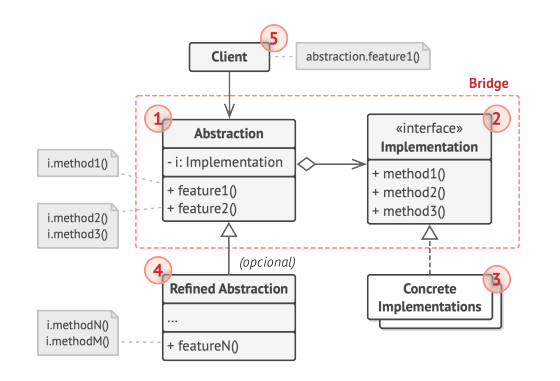

# Bridge (También llamado: Puente)

<p align="justify">
Bridge es un patrón de diseño estructural que te permite dividir una clase grande, o un grupo de clases estrechamente relacionadas, en dos jerarquías separadas (abstracción e implementación) que pueden desarrollarse independientemente la una de la otra.
</p>

## ¿Problema? :(
<p align="justify">
¿Abstracción? ¿Implementación? ¿Asusta?
</p>

<p align="justify">

-   Problema: Imagina que tienes una jerarquía de clases con diferentes tipos de formas (por ejemplo, Círculo y Cuadrado) y diferentes formas de representarlas (como Dibujar en pantalla y Dibujar en papel). La combinación de cada forma con cada tipo de representación puede llevar a una gran cantidad de clases (por ejemplo, CírculoEnPantalla, CuadradoEnPantalla, CírculoEnPapel, etc.).
    
-   Solución: Con el patrón Bridge, puedes separar la forma (abstracción) de su representación (implementación), lo que permite combinarlas de manera flexible sin crear múltiples clases para cada combinación.
</p>

## Estructura del Patrón

<p align="justify">
-   Componentes Clave:
    

-   Abstracción: Define la interfaz de alto nivel para los clientes.
    
-   Implementación: Define la interfaz para la implementación que será "conectada" a la abstracción.
    

***Diagrama UML:***



</p>

#  Ejemplo en C# del Patrón Bridge
<p align="justify">
-  ***Abstracción***: En este caso, la **abstracción** se centra en el concepto de un jugador de fútbol, independientemente de cómo juegue. La abstracción encapsula el comportamiento general que un jugador debe tener, pero delega los detalles específicos a una "implementación" concreta.
 </p>
 
 <p align="justify">
-  ***Implementación***: La **implementación** en el patrón Bridge se refiere a la parte que proporciona la lógica concreta de cómo se realiza una acción. En este caso, la **implementación** se centra en las estrategias de juego (`Ataque`, `EstrategiaDefensiva`). Estas clases implementan el comportamiento específico de cómo los jugadores deben actuar en el campo.
</p>

```using System;

// Interfaz de Implementación
public interface IEstrategia
{
    void Jugar();
}

// Clases Concretas de Implementación
public class Ataque : IEstrategia
{
    public void Jugar()
    {
        Console.WriteLine("Jugando al ataque");
    }
}

public class EstrategiaDefensiva : IEstrategia
{
    public void Jugar()
    {
        Console.WriteLine("Jugando a la defensa");
    }
}

// Clase Abstracción
public abstract class Jugador
{
    protected IEstrategia estrategia;

    protected Jugador(IEstrategia estrategia)
    {
        this.estrategia = estrategia;
    }

    public abstract void Jugar();
}

// Clases Concretas de Abstracción
public class Delantero : Jugador
{
    public Delantero(IEstrategia estrategia) : base(estrategia) { }

    public override void Jugar()
    {
        Console.Write("Delantero: ");
        estrategia.Jugar();
    }
}

public class Defensa : Jugador
{
    public Defensa(IEstrategia estrategia) : base(estrategia) { }

    public override void Jugar()
    {
        Console.Write("Defensa: ");
        estrategia.Jugar();
    }
}

// Uso del Patrón Bridge
class Program
{
    static void Main()
    {
        // Crear jugadores con diferentes estrategias
        Jugador delanteroAtaque = new Delantero(new Ataque());
        delanteroAtaque.Jugar();  // Salida: Delantero: Jugando al ataque

        Jugador defensaDefensiva = new Defensa(new EstrategiaDefensiva());
        defensaDefensiva.Jugar();  // Salida: Defensa: Jugando a la defensa

        // Cambiar estrategia fácilmente
        Jugador delanteroDefensivo = new Delantero(new EstrategiaDefensiva());
        delanteroDefensivo.Jugar();  // Salida: Delantero: Jugando a la defensa
    }
}
