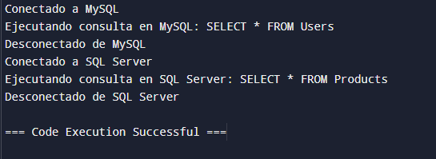

# Bridge (También llamado: Puente)

<p align="justify">
Bridge es un patrón de diseño estructural que te permite dividir una clase grande, o un grupo de clases estrechamente relacionadas, en dos jerarquías separadas (abstracción e implementación) que pueden desarrollarse independientemente la una de la otra.
</p>

## ¿Problema? :(
<p align="justify">
¿Abstracción? ¿Implementación? ¿Asusta?
</p>

<p align="justify">

-   Problema: Imagina que tienes una jerarquía de clases con diferentes tipos de formas (por ejemplo, Círculo y Cuadrado) y diferentes formas de representarlas (como Dibujar en pantalla y Dibujar en papel). La combinación de cada forma con cada tipo de representación puede llevar a una gran cantidad de clases (por ejemplo, CírculoEnPantalla, CuadradoEnPantalla, CírculoEnPapel, etc.).
    
-   Solución: Con el patrón Bridge, puedes separar la forma (abstracción) de su representación (implementación), lo que permite combinarlas de manera flexible sin crear múltiples clases para cada combinación.
</p>

## Estructura del Patrón

<p align="justify">
-   Componentes Clave:
    

-   Abstracción: Define la interfaz de alto nivel para los clientes.
    
-   Implementación: Define la interfaz para la implementación que será "conectada" a la abstracción.

</p>

#  Ejemplo en C# del Patrón Bridge
<p align="justify">
El objetivo es separar la abstracción (que en este caso es la conexión a una base de datos) de la implementación (el tipo específico de base de datos) para que puedas cambiar el tipo de base de datos sin modificar el código de la abstracción.
</p>

```
using System;

// Interfaz de Implementación
public interface IDatabaseImplementor
{
    void Connect();
    void Disconnect();
    void ExecuteQuery(string query);
}

// Clases Concretas de Implementación
public class MySQLImplementor : IDatabaseImplementor
{
    public void Connect()
    {
        Console.WriteLine("Conectado a MySQL");
    }

    public void Disconnect()
    {
        Console.WriteLine("Desconectado de MySQL");
    }

    public void ExecuteQuery(string query)
    {
        Console.WriteLine("Ejecutando consulta en MySQL: {query}");
    }
}

public class SQLServerImplementor : IDatabaseImplementor
{
    public void Connect()
    {
        Console.WriteLine("Conectado a SQL Server");
    }

    public void Disconnect()
    {
        Console.WriteLine("Desconectado de SQL Server");
    }

    public void ExecuteQuery(string query)
    {
        Console.WriteLine("Ejecutando consulta en SQL Server: {query}");
    }
}

// Clase Abstracción
public abstract class Database
{
    protected IDatabaseImplementor implementor;

    protected Database(IDatabaseImplementor implementor)
    {
        this.implementor = implementor;
    }

    public abstract void OpenConnection();
    public abstract void CloseConnection();
    public abstract void RunQuery(string query);
}

// Clases Concretas de Abstracción
public class AbstractionMySQL : Database
{
    public AbstractionMySQL(IDatabaseImplementor implementor) : base(implementor) { }

    public override void OpenConnection()
    {
        implementor.Connect();
    }

    public override void CloseConnection()
    {
        implementor.Disconnect();
    }

    public override void RunQuery(string query)
    {
        implementor.ExecuteQuery(query);
    }
}

public class AbstractionSQLServer : Database
{
    public AbstractionSQLServer(IDatabaseImplementor implementor) : base(implementor) { }

    public override void OpenConnection()
    {
        implementor.Connect();
    }

    public override void CloseConnection()
    {
        implementor.Disconnect();
    }

    public override void RunQuery(string query)
    {
        implementor.ExecuteQuery(query);
    }
}

// Uso del Patrón Bridge
public class Program
{
    public static void Main()
    {
        // Usar MySQL con la abstracción
        Database mySQLDatabase = new AbstractionMySQL(new MySQLImplementor());
        mySQLDatabase.OpenConnection();  // Salida: Conectado a MySQL
        mySQLDatabase.RunQuery("SELECT * FROM Users");  // Salida: Ejecutando consulta en MySQL: SELECT * FROM Users
        mySQLDatabase.CloseConnection();  // Salida: Desconectado de MySQL

        // Usar SQL Server con la abstracción
        Database sqlServerDatabase = new AbstractionSQLServer(new SQLServerImplementor());
        sqlServerDatabase.OpenConnection();  // Salida: Conectado a SQL Server
        sqlServerDatabase.RunQuery("SELECT * FROM Products");  // Salida: Ejecutando consulta en SQL Server: SELECT * FROM Products
        sqlServerDatabase.CloseConnection();  // Salida: Desconectado de SQL Server
    }
}


```
## Salida: 


https://www.programiz.com/csharp-programming/online-compiler/

### Ventajas

-   ***Desacoplamiento:*** Separa la abstracción de la implementación, lo que facilita cambios en ambas partes sin afectar a la otra.
    
-   ***Flexibilidad:*** Permite combinar diferentes abstracciones e implementaciones de manera independiente.
    
-   ***Reducción de código duplicado:*** Al evitar combinaciones rígidas, reduce la necesidad de crear múltiples clases para cada variante.
    

### Desventajas

-   ***Complejidad***: Puede introducir complejidad adicional debido a la separación en diferentes clases y la necesidad de configurar correctamente las conexiones entre ellas.
    

### Ejemplos en el Mundo Real

-   ***Interfaz Gráfica de Usuario (GUI):*** Separa la lógica de los controles de la ventana (abstracción) del sistema operativo específico en el que se ejecuta (implementación).
    

- ***Conexión a bases de datos:*** La abstracción puede ser el "conector" de la base de datos, y las implementaciones podrían variar entre diferentes bases de datos (MySQL, PostgreSQL, etc.).
